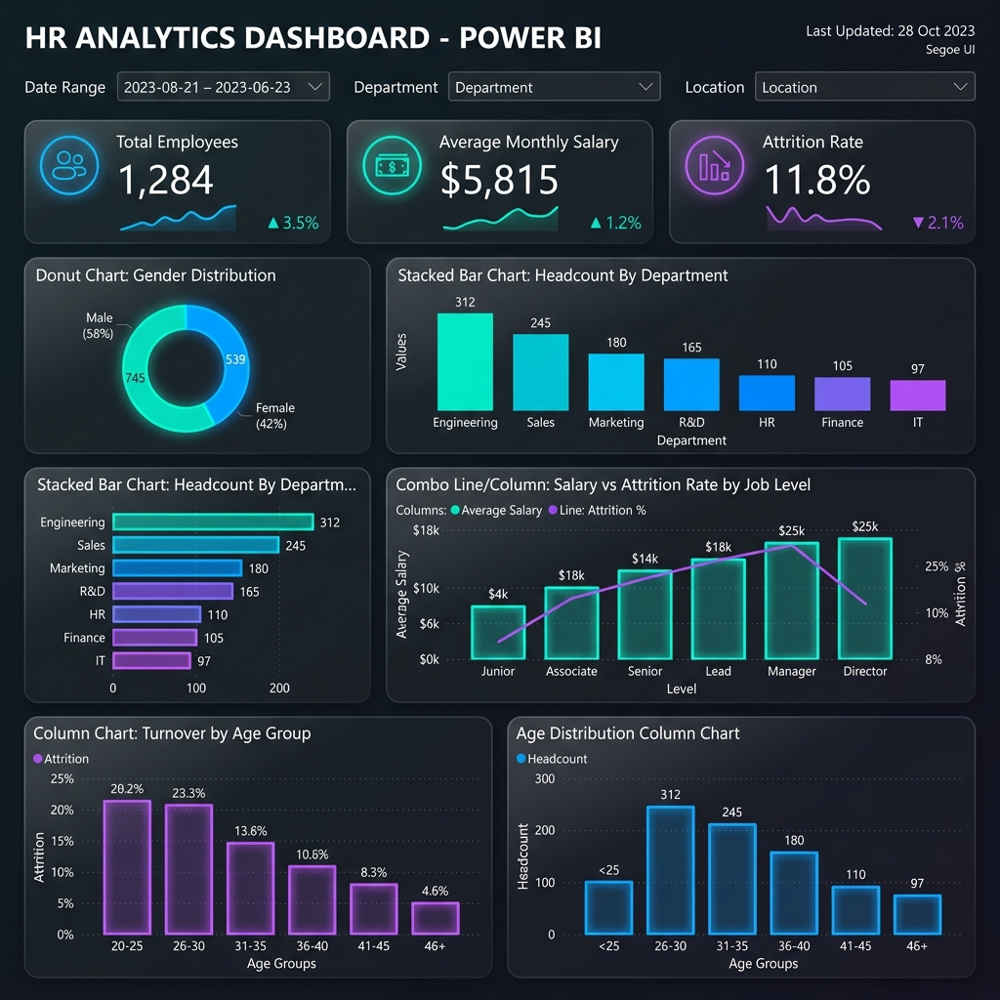

# HR Analytics & Employee Attrition Dashboard 📊👥

An interactive **Power BI Dashboard** designed to analyze workforce demographics, department distributions, compensation, and key attrition (turnover) drivers. This dashboard integrates data visualization and exploratory analysis to deliver actionable human resource insights that support employee retention, workforce planning, and organizational development.

---

## 📌 Project Overview
Employee turnover is a critical and costly challenge for modern organizations. This project provides a holistic view of the workforce, allowing HR teams and leadership to drill down into employee attrition patterns. By analyzing relationships between salary levels, job roles, educational backgrounds, age groups, and employee tenure, the dashboard highlights high-risk segments and helps design targeted retention strategies.

### Key Tools & Technologies:
*   **BI Platform**: Power BI Desktop
*   **Data Prep & Processing**: Power Query, DAX (Data Analysis Expressions)
*   **Dataset**: Workforce and employee feedback parameters (including demographics, income, department, job role, and tenure)

---

## 🖥️ Dashboard Architecture & Metrics

The dashboard provides a unified view structured around key HR metrics:

### 1. Key Performance Indicators (KPIs)
*   **Total Employees**: The total count of active and historic employees in the dataset.
*   **Employees ≤ 1 Year**: Highlights recent hires to monitor early-stage retention and onboarding effectiveness.
*   **Average Monthly Salary**: Baseline compensation metric to compare salary distribution across job roles.
*   **Employees Left (in %)**: The overall attrition rate, representing the percentage of employees who have exited the organization.

### 2. Workforce Demographics & Profile
*   **Gender Distribution (Donut Chart)**: Visualizes the gender balance across the organization.
*   **Age Distribution & Turnover by Age Group (Column Charts)**: Highlights the workforce age structure and identifies which age groups have the highest attrition rates.
*   **Employees By Education Field (Column Chart)**: Displays employee distributions across educational background domains.

### 3. Organizational Structure & Roles
*   **Headcount & Attrition By Department (Clustered Charts)**: Compares headcount and turnover rates across major departments (e.g., R&D, Sales, HR) to pinpoint department-specific issues.
*   **Employees By Job Role (Bar Chart)**: Explores workforce distribution across operational job roles.

### 4. Compensation & Retention Analysis
*   **Salary vs. Turnover Rate by Job Level (Combo Chart)**: Analyzes how monthly income relates to job level and attrition, highlighting if lower compensation levels correlate with higher turnover rates.

🖼️ *Dashboard Visual:*


---

## 📈 Key Insights & Recommendations
1.  **Early Tenure Attrition**: Monitor employees with less than 1 year of tenure. A high turnover rate in this segment indicates the need to refine onboarding processes and set clear initial expectations.
2.  **Compensation Correlation**: Analyze job levels showing high turnover rates compared to their average monthly salary. Aligning compensation with market benchmarks is crucial for retaining high-performing staff in junior roles.
3.  **Age Group Hotspots**: Targeted retention programs (e.g., career development plans, mentoring) should focus on age brackets showing disproportionately high attrition rates.
4.  **Departmental Variances**: Investigate departments with elevated turnover levels to address leadership styles, workload balance, or growth opportunities.

---

## 📂 Repository Structure
```directory
.
├── assets/                          # Dashboard screenshots and visuals (PNG)
│   └── pg1.png                      # Main HR Analytics Dashboard page view
├── HR_Analytics.pbix                # Power BI Desktop source file
└── README.md                        # Project documentation (this file)
```

---

## 🚀 How to Run the Project
1.  **Clone the repository**:
    ```bash
    git clone https://github.com/aryanraj71/HR-Analytics-Dashboard.git
    cd HR-Analytics-Dashboard
    ```
2.  **Open in Power BI**:
    *   Make sure you have [Power BI Desktop](https://powerbi.microsoft.com/desktop/) installed.
    *   Double-click `HR_Analytics.pbix` to launch the dashboard.
